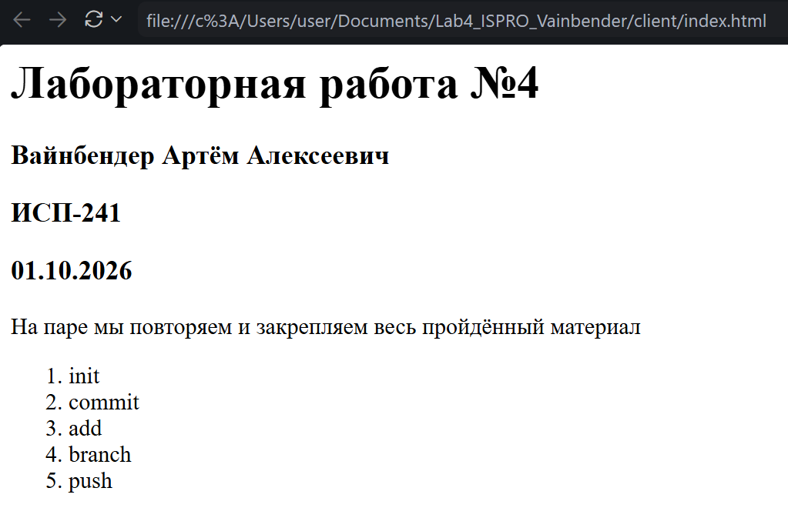
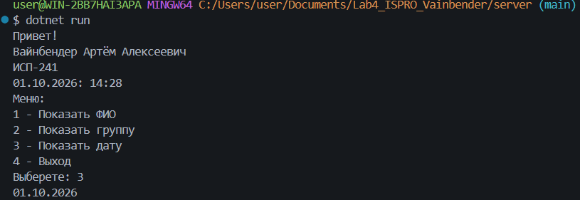
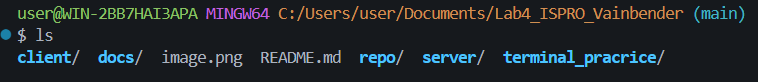
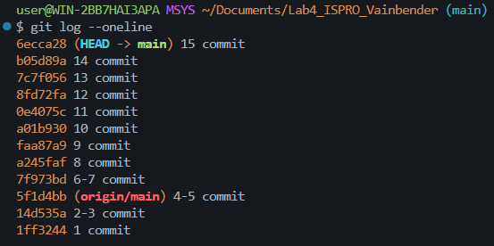

# Лабораторная работа №4. Закрепление навыков работы с Git, Markdown,  терминалом и проектной структурой

### Вайнбендер Артём Алексеевич
### ИСП-241
### 01.10.2026
---
**Повторение всего изученного нами материала**
---
### Содержание:
1. СОЗДАНИЕ НОВОЙ СТРУКТУРЫ ПРОЕКТА
2. FRONTEND (client)
3. BACKEND (server)
4. ПРАКТИКА ТЕРМИНАЛА
5. РАБОТА С MARKDOWN (docs/markdown_examples.md)
6. README.md (главный файл проекта)
7. СКРИНШОТЫ
---
### Структура проекта
- Lab4_ISPRO_Vainbender
    - client
    - docs
    - repo
    - server 
        - bin
        - obj
    - terminal_pracrice 
        - data
        - logs
    - README.md
## Примеры Markdown:
# Заголовок
1. спи
2. сок

```csharp
Console.Write("пример");
```
$a^2 + b^2 = c^2$$
$$
\sum_{i=1}^n i = \frac{n(n+1)}{2}
$$
[ссылка на репозиторий](https://github.com/ArtemVay/Lab4_ISRPO_Vainbender.git)
 ---
### Cкриншоты





### Всё повторили